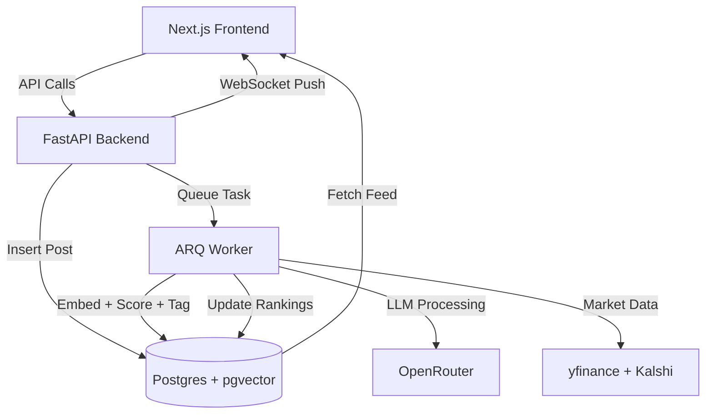

# Stock Insights Social Platform – Full Product Requirements Document (PRD)

## 1. Overview
A social-driven platform for sharing stock analyses, trading ideas, and market insights. Users post content, react, follow tickers, and receive personalized feeds. An LLM backend performs semantic tagging, quality scoring, summarization, and ranking using market data and embeddings.

## 2. Goals
- Enable social posting and engagement.
- Provide high-quality insights via LLM processing.
- Deliver personalized feeds influenced by semantic signals, market data, and user reputation.
- Produce transparent explanations for recommendations.
- Allow backend reuse as a Python package or FastAPI microservice.
- MVP-first approach with planned scalability.

## 3. Architecture Summary
- **Frontend:** Next.js / React on Vercel
- **Backend:** FastAPI + ARQ (Redis) for async task processing
- **Database:** Neon Postgres (pgvector enabled)
- **LLM Provider:** OpenRouter (embedding + tagging + summarization)
- **Market Data:** yfinance + Kalshi (event probabilities)
- **Auth:** Clerk
- **Real-time:** WebSockets (FastAPI) or SSE

## 4. Core Features

### 4.1 User Features
- Post insights with tickers auto-detected.
- Follow users or tickers.
- React (like/dislike), comment, bookmark.
- Personalized feed.
- Trending tickers view.
- User reputation scores.
- Insight transparency modal with LLM explanation.

### 4.2 Insight Intelligence (LLM Engine)
- **Semantic Tagging:** Sectors, catalysts, risk, insight type.
- **Summaries:** One-line & extended.
- **Quality Scoring:** 0–1 normalized.
- **Embeddings:** Using `text-embedding-3-small`.
- **Classification:** Fundamental / Technical / Macro / Earnings / Risk Warning.
- **Reputation Update:** Poster gains/loses rep based on quality & engagement.
- **Explanation Generation:** Natural-language reasoning for ranking.

### 4.3 Market-Aware Ranking
Factors:
- Post quality score
- User reputation
- Semantic relevance
- Market conditions (price change, volume spike, earnings proximity)
- Event probabilities (Kalshi)
- Engagement velocity (likes/time)
- Feed diversity controls

### 4.4 Real-Time Updates
- Feed updates pushed via WebSockets.
- Ranking recalculates post-ingestion.
- Market events trigger re-ranking.

---

## 5. Detailed Architecture

### 5.1 High-Level Diagram (Mermaid)


### 5.2 Backend Components
- **FastAPI Routers:**
  - `/posts`
  - `/feed`
  - `/users`
  - `/rankings`
  - `/market`
  - `/insights`
- **ARQ Workers:**
  - `process_post`
  - `update_rankings`
  - `refresh_market_data`
  - `recompute_reputation`
  - `generate_embeddings_batch`
- **LLM Service Layer:**
  - `embed_text()`
  - `tag_post()`
  - `summarize_post()`
  - `score_post()`
  - `explain_ranking()`

---

## 6. Database Design

### 6.1 Tables

### `users`
```
id (pk)
username
email
profile_image
created_at
premium boolean
```

### `posts`
```
id (pk)
user_id (fk)
content text
tickers text[]
raw_sentiment numeric
llm_status enum(pending, processed, failed)
created_at
```

### `post_embeddings`
```
id
post_id (fk)
embedding vector(1536)
type enum(content, summary)
created_at
```

### `insights`
```
id
post_id (fk)
insight_type text
sector text
catalyst text
risk_profile text
quality_score numeric
summary text
explanation text
created_at
```

### `reputation`
```
user_id (fk)
overall_score numeric
sector_expertise jsonb
historical_accuracy numeric
community_impact numeric
updated_at
```

### `market_snapshots`
```
id
ticker text
price numeric
volume numeric
open numeric
high numeric
low numeric
close numeric
timestamp timestamptz
source text
```

### `post_engagement`
```
id
post_id (fk)
user_id (fk)
type enum(like, dislike, comment)
comment text
created_at
```

### `llm_audit_logs`
```
id
post_id
task_type
input jsonb
output jsonb
model text
latency_ms integer
created_at
```

### Optional tables
- `feed_ranking`
- `related_insights`
- `earnings_events`
- `tags`

---

## 7. Insight Processing Pipeline

### 7.1 Steps
1. User creates post.
2. FastAPI stores raw post.
3. ARQ queues `process_post`.
4. Worker performs:
   - Clean & normalize content.
   - Detect tickers (regex + validation).
   - Call LLM for tagging.
   - Generate embeddings.
   - Score quality.
   - Summarize content.
   - Write into insights table.
   - Write embeddings.
   - Trigger reputation update for author.
5. Trigger feed ranking update.

---

## 8. Ranking Engine

### 8.1 Ranking Formula (Example)
```
final_score =
    (quality_score * 0.35) +
    (user_reputation * 0.20) +
    (semantic_relevance * 0.20) +
    (market_alignment * 0.15) +
    (engagement_velocity * 0.10)
```

### 8.2 Market Alignment Heuristics
- If price up > 2% in last 10 mins → surface bullish insights.
- If volume spike > 20% → prioritize catalysts.
- If earnings within 5 days → prioritize fundamental/forecast insights.

---

## 9. Market Data Integration

### Data from:
- **yfinance:**
  - Realtime price, volume, OHLC
  - Earnings calendar
- **Kalshi:**
  - Event probabilities
  - Volatility expectations
  - Macro event markets

### Frequency:
- Every 30–60 seconds (MVP)
- Cached in Redis for rapid access

---

## 10. LLM Interaction Models

### 10.1 Embeddings
- Model: `text-embedding-3-small`
- Per post: content + summary embeddings

### 10.2 Tagging & Classification
- Model: `gpt-4o-mini`
- Outputs:
  - Insight type
  - Sector
  - Catalyst type
  - Risk level
  - Sentiment direction

### 10.3 Summaries
- 1–2 line summary
- 50–100 word digest

### 10.4 Explanations
- “Why was this post shown to you?” explanation:
  - Semantic similarity
  - Reputation score
  - Market context

---

## 11. Queue / Async Design

### ARQ Tasks
- `process_post`
- `recompute_ranking`
- `ingest_market_data`
- `batch_embed_posts`

### Redis keys
- `market:cache:<ticker>`
- `feed:user:<id>`

---

## 12. Real-Time Feed

### Tech:
- WebSockets via FastAPI
- Redis pub/sub triggers
- Automatic push when:
  - New post processed
  - Market event change triggers re-ranking

---

## 13. MVP Scope (Strict)

### In Scope
- Post creation
- Tagging pipeline
- Embedding search
- Personalized feed
- Market data integration (yfinance only)
- Reputation scoring
- WebSocket updates
- Insights & explanations

### Out of Scope
- Polymarket (post-MVP)
- Reinforcement learning
- Expert-tier models (Claude Sonnet)
- Advanced clustering
- Premium tier

---

## 14. API Endpoints (MVP)

### `/posts/create`
Create raw post → returns ID.

### `/posts/:id`
Fetch post + insights.

### `/feed`
Personalized feed.

### `/rankings/recompute`
Trigger ranking job.

### `/market/:ticker`
Latest snapshot.

---

## 15. Deployment Plan

### Backend:
- FastAPI on Fly.io or Render
- Worker on separate dyno
- Redis (Upstash)
- Neon Postgres

### Frontend:
- Next.js on Vercel

---

## 16. Future Enhancements
- Premium tier insights
- Claude Sonnet-powered expert tagging
- Vector DB migration
- LLM-driven moderation
- Portfolio simulation tools
- Pattern detection (LLM + embeddings)
- Mobile app
